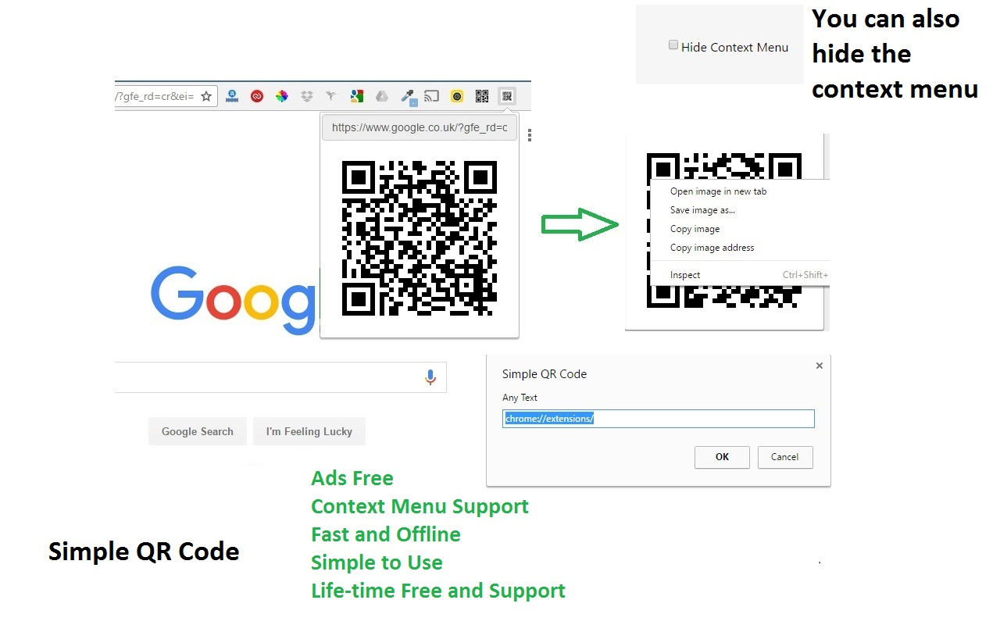
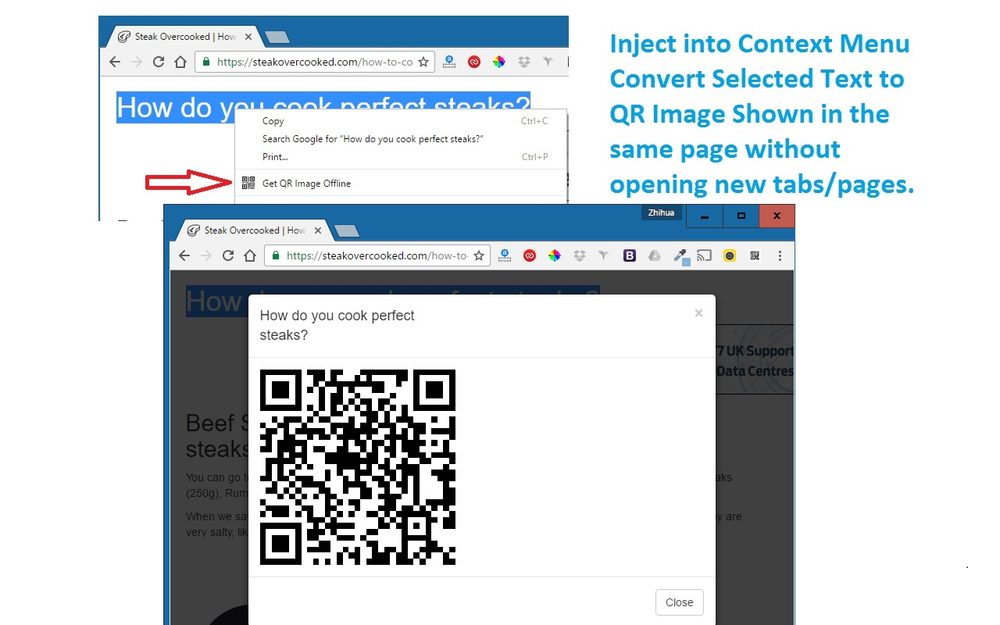

# Offline QR Code Generator/Editor

> A fast, ads-free, **fully offline** Chrome extension that turns the current tab URL - or any selected text - into a QR code you can edit and download.

[](https://github.com/doctorlai/simple-qr-code/actions/workflows/ci.yml)
[](https://nodejs.org/)
[](https://developer.chrome.com/docs/extensions/develop/migrate/what-is-mv3)
[](https://chrome.google.com/webstore/detail/simple-qr-code-offline-no/kfhbhjigpkcbpmknfomdobahejfajado)
[](https://chrome.google.com/webstore/detail/simple-qr-code-offline-no/kfhbhjigpkcbpmknfomdobahejfajado)
[](https://chrome.google.com/webstore/detail/simple-qr-code-offline-no/kfhbhjigpkcbpmknfomdobahejfajado)
[](LICENSE)
[](CONTRIBUTING.md)
[](https://github.com/prettier/prettier)

| Popup                               | On-page editor                    |
| ----------------------------------- | --------------------------------- |
|  |  |

## Features

- **100% offline & fast** - QR codes are generated locally with [`qrcode.js`](https://github.com/davidshimjs/qrcodejs); no network requests, ever.
- **One click** - open the popup to instantly get a QR code for the current tab URL.
- **Context-menu support** - select any text on a page, right-click, and choose _"Get QR for Selected Text or Tab URL"_.
- **Inline editing** - edit QR text directly in the popup or on-page overlay without modal prompts.
- **Download as PNG** - save generated QR images from the popup or the on-page overlay.
- **Copy QR text** - copy the current popup text back to your clipboard.
- **Clean, ads-free UI** - no author links, no tracking, no nonsense.
- **Multi-language** - 25 Chrome locale folders, including English, Chinese, Arabic, Bengali, German, Spanish, French, Hindi, Indonesian, Italian, Japanese, Korean, Dutch, Polish, Portuguese, Russian, Tamil, Telugu, Thai, Turkish, and Vietnamese.

## Install

### From the Chrome Web Store (recommended)

**[Install Offline QR Code Generator/Editor](https://chrome.google.com/webstore/detail/simple-qr-code-offline-no/kfhbhjigpkcbpmknfomdobahejfajado)**

### Load the unpacked extension (for development)

1. Clone this repository.
2. Open `chrome://extensions` in Chrome.
3. Toggle **Developer mode** (top-right).
4. Click **Load unpacked** and select the [`simple-qr-code/`](simple-qr-code) folder.

## Usage

- **Tab URL to QR:** click the toolbar icon. The popup shows a QR code for the current page; edit the text, update the QR, copy the text, reset to the tab URL, or download the PNG.
- **Selected text to QR:** highlight text on any page, right-click, and choose _"Get QR for Selected Text or Tab URL"_. A draggable QR editor appears on the page with update, download, and close controls.
- **Hide the context menu:** open the extension **Options** and tick _"Hide Context Menu"_.

## Permissions

This extension asks for the minimum it needs and collects **no data**:

| Permission                    | Why it is needed                                                    |
| ----------------------------- | ------------------------------------------------------------------- |
| `activeTab`                   | Read the current tab's URL when you open the popup or context menu. |
| `storage`                     | Remember whether you have hidden the context menu.                  |
| `contextMenus`                | Add the right-click _"Get QR"_ menu item.                           |
| `<all_urls>` (content script) | Render the QR overlay on the page you are viewing.                  |

## Development

Requires [Node.js](https://nodejs.org/) **>= 18**.

```bash
npm install        # install dev tooling
npm run check      # lint + format check + tests with coverage threshold
npm run build      # package dist/simple-qr-code-v<version>.zip for the Web Store
```

| Script                 | Description                                  |
| ---------------------- | -------------------------------------------- |
| `npm run lint`         | Lint with ESLint                             |
| `npm run lint:fix`     | Lint and auto-fix                            |
| `npm run format`       | Format with Prettier                         |
| `npm run format:check` | Verify formatting                            |
| `npm test`             | Run Jest unit tests                          |
| `npm run coverage`     | Run tests and enforce the coverage threshold |
| `npm run check`        | Lint + format check + coverage               |
| `npm run build`        | Build the Chrome Web Store zip into `dist/`  |
| `npm run ci`           | `check` followed by `build`                  |

See [CONTRIBUTING.md](CONTRIBUTING.md) for the full workflow.

## Project structure

```
simple-qr-code/        # the unpacked extension (manifest.json at its root)
  js/
    context.js         # MV3 background service worker (context menu)
    qr.js              # popup editor, Copy Text, Download PNG
    contentscript.js   # on-page draggable QR editor
    lib/qrutils.js     # pure, unit-tested helpers
  _locales/            # i18n message catalogs
  images/              # icons
scripts/build.js       # packages the extension into dist/*.zip
test/                  # Jest unit tests
```

## Contributing

Contributions are welcome! Please read [CONTRIBUTING.md](CONTRIBUTING.md) and run
`npm run check` before opening a pull request.

## Support / Sponsor

If this extension is useful to you, consider buying the author a coffee:

- [Buy me a coffee](https://justyy.com/out/bmc)
- [PayPal](https://www.paypal.me/doctorlai/3)
- [GitHub Sponsors / Patreon](https://github.com/doctorlai)

## License

[MIT](LICENSE) (c) Zhihua Lai ([justyy](https://justyy.com))

## Resources

- Online tools: <https://helloacm.com/tools/>
- How QR images are generated: <https://helloacm.com/how-to-generate-qr-image-using-google-api/>
- Chrome Web Store listing: <https://chrome.google.com/webstore/detail/simple-qr-code-offline-no/kfhbhjigpkcbpmknfomdobahejfajado>
